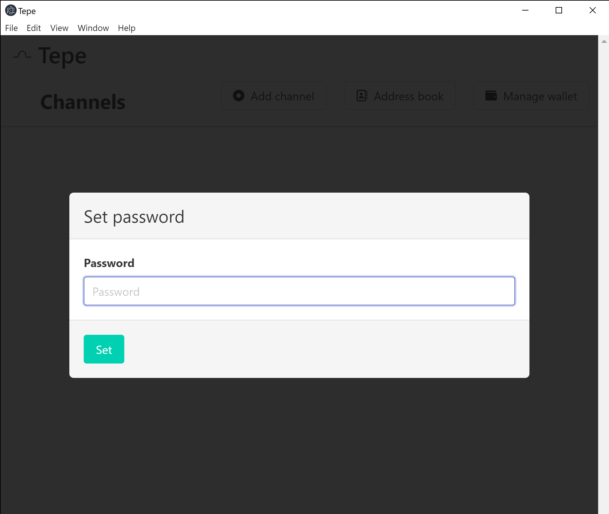
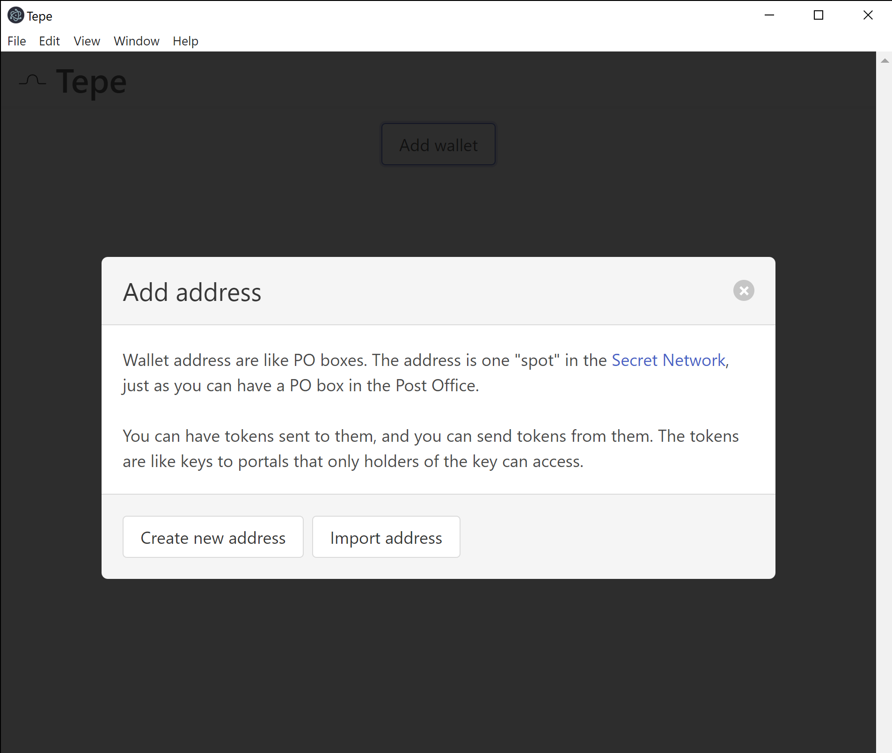
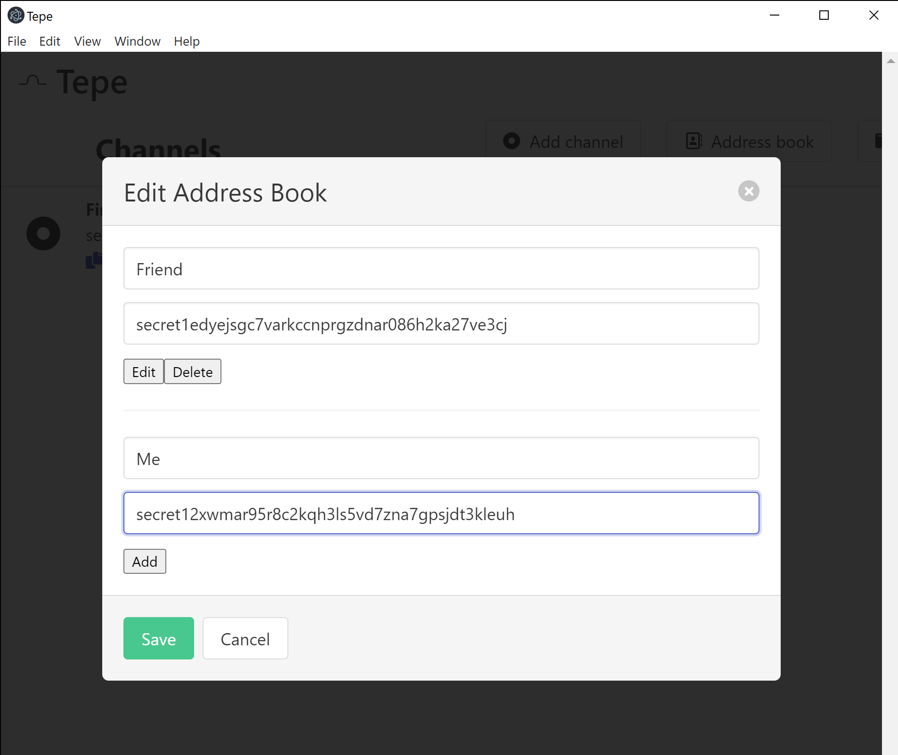
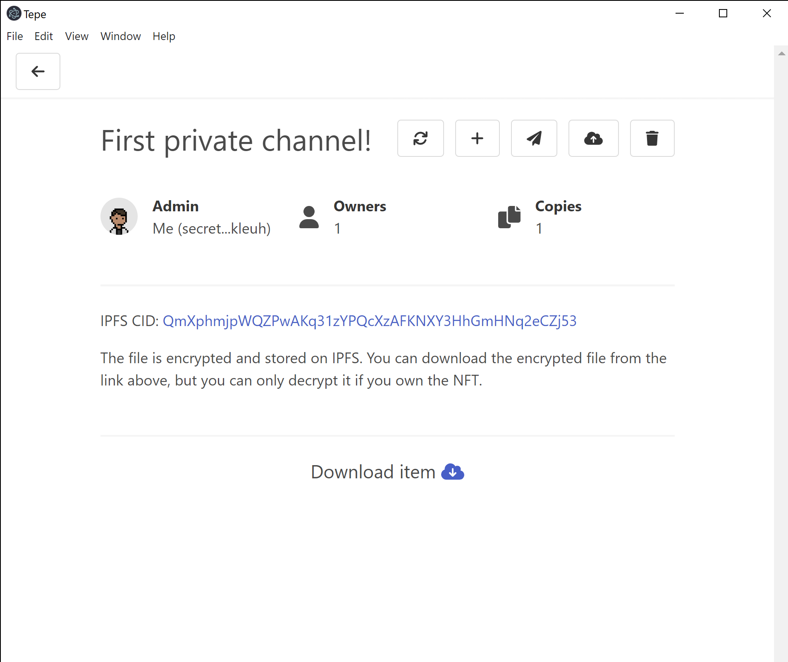
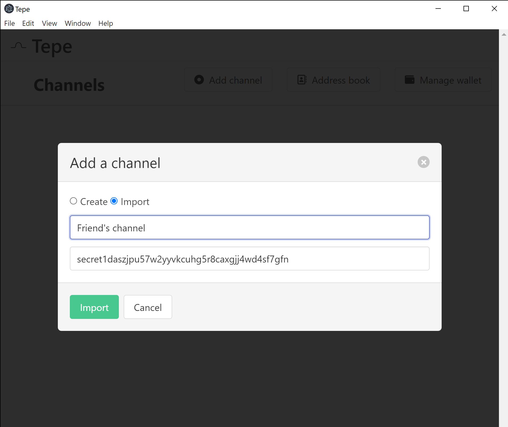
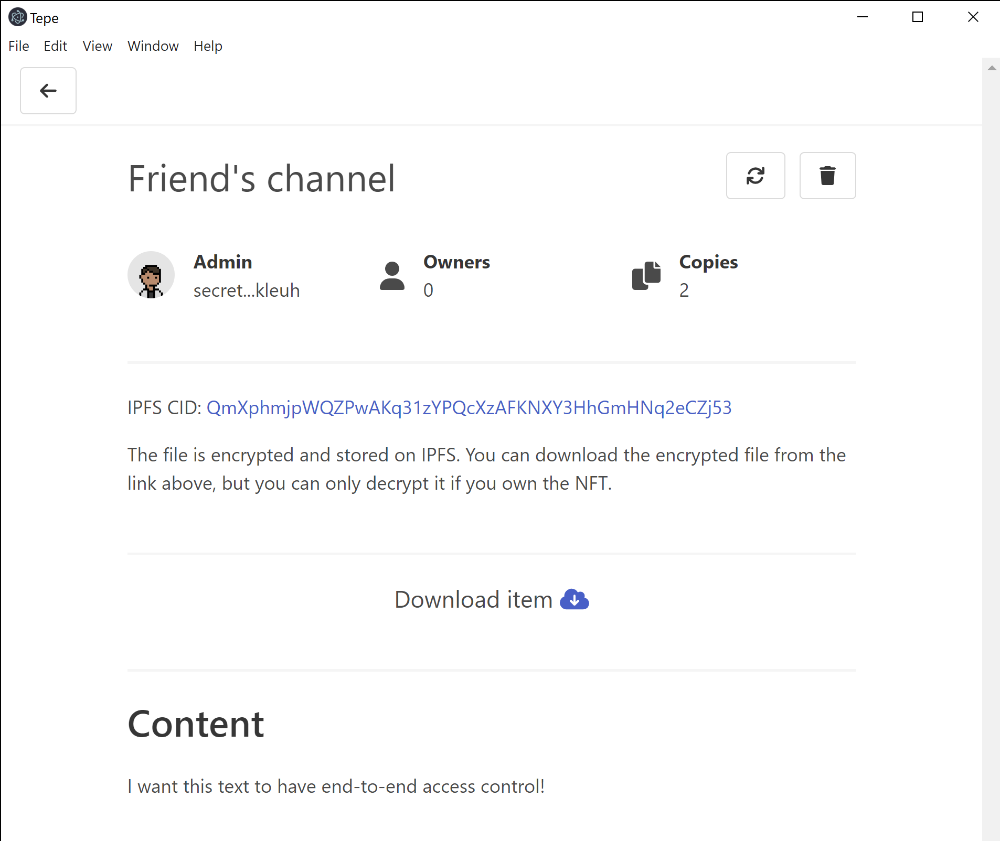

# Tepe app

We have created a Tepe app that handles all the steps necessary for end-to-end token gating of content.  With it, you can easily grant someone access to a pdf you've uploaded, and know that only they can decrypt its contents.

From within the app, you can:
<ul>
	<li>Open a Tepe channel, which creates a new instantiation of the Tepe contract on the Secret Pulsar-2 testnet</li>
	<li>Upload content -- of arbitrary filetype -- to IPFS (https://ipfs.tech) to be gated by the Tepe channel</li>
	<li>Mint NFTs that grant access to other Secret accounts</li>
	<li>Download and decrypt content for channels to which you have access</li>
</ul>

You have a couple options to try out the app.  

## Run our packaged Windows executable (tepe.exe). 

You have to click past the Windows security screen that pops up (click "Run anyway") because we have not yet invested the several hundred dollars to buy a certificate and become trusted developers. Perhaps someday!

## Compile and run the app from the source code in this repo.

The files in this repo can be cloned to run the [electron](https://www.electronjs.org/) app directly.

We use [yarn](https://yarnpkg.com/) to manage packages.  In the directory where you've copied this repo, type the following at the command line 

```
yarn install
yarn electron:serve
```

## How to use the app, step by step 

### 1. Set a password to protect private keys
Whether you ran the executable or compiled it yourself, an electron window will open and the first thing to do is set a password to protect your private key(s).



You'll reach the home page displaying all Tepe channels, which is empty for now:


### 2. Create or import a Secret address 

To exist on the blockchain, you need a Secret address.  You can create one, in which case you'll need to go get some (free) test `scrt` from the [Secret faucet](https://faucet.pulsar.scrttestnet.com/).  `scrt` is how you'll pay for all of the contract transactions (like instantiating a Tepe contract, minting NFTs, changing metadata, etc.)

If you already have a Secret address for the Pulsar-2 testnet, you can import it:



Afterward, you should see an address listed in the wallet page:


### 3. Use the address book to store important addressses

You can paste the public Secret address and a nickname for as many addresses as you want, to make it easier when you mint and transfer NFTs.



### 4. Create a Tepe channel

We can now create a channel -- which instantiates a new version of our Tepe smart contract on the Secret testnet.


Unlike contract instantiation on chains like Ethereum, which cost a lot of gas each time, on Secret you only pay a lot of gas once when you upload the contract blueprint.
Each instantiation afterward is cheap, so you can make new channels (each their own instance of the contract we wrote) to your heart's content.

You can then enter the channel, and should see the following


### 5. Upload content to IPFS

The contract's private state only stores the password necessary to decrypt a file.  The file itself, after encryption, can be stashed anywhere.
We use IPFS to store the encrypted file, but you can do whatever you want (like host the file yourself, use a completely public google drive link, etc.).

If you are using a packaged version of the app, this is handled automatically for you.  If you are compiling yourself from the source code in this repo, you'll need to set up file hosting.

If you want to use IPFS, you need a gateway that will allow you to upload -- the easiest way we found was to create a free Infura account 
(though it requires a credit card in case you store more than 5GB).
If you go this route, save a file `.env` in the local directory and enter the necessary API data that infura gives you: 
```
PROJECT_ID=2DG3**************** 
PROJECT_SECRET=806f**********************
```

Consuming content (downloading from IPFS) is much easier -- just find a good public gateway from [IPFS public gateway checker](https://ipfs.github.io/public-gateway-checker/).

Anyway, once you have a way to upload to IPFS, you can upload **anything**.  Starting with a txt file, you should see something like the following:



### 6. Minting NFTs to granting access
You can mint and transfer NFTs with the buttons at the top of the channel page.  Let's send one to a friend:


### 7. The receiving side: the content viewer
If you are a subscriber to content, or just the viewer for a particular channel, you can import the channel that was created by its public address



Now the channel page has fewer buttons, because you can't mint, transfer, or upload to the contract.  However, if you have the NFT, you can download and decrypt


If the file was a text file, its contents will display in the app on the channel page:



For any other file types, you select the download location and can retrieve your decrypted file from the path shown in the app:


You can re-upload files as much as you want for any given channel, so here we replaced the txt file with an image called `tepe.png`.
